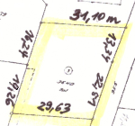

# geolocation_waldrain

Python geolocation calculation for the [Waldrain](https://waldrain.github.io) plot of land.

To begin with, I had six unconfirmed latitude and longtitude coordinates for the six corner points for a plot of land.

I also had pretty precise edge length and area measurements in metres:



That leads to the following data:

```
pts = [
  [47.61240287934088,7.668455564143808],
  [47.61238603493116,7.66886803694362],
  [47.61227235282722,7.668805013356426],
  [47.612081232450755,7.668710772100395],
  [47.61209766306042,7.668317607008359],
  [47.612263038360155,7.668392271613928]]

tags = ['NW','NO','OM','SO','SW','WM']

edge_length = [ # in metres
  31.10, # Nord
  13.34, 22.51, # Ost
  29.63, # Sued
  19.26, 16.24 ] # West

area = 1043 # square metres
```

## Task

Calculate the expected edge lengths and area from the given latitude and longtitude coordinates.

## Solution

I found various answers and articles describing how to calculate the distance in metres between to points given their latitude and longitude.

The simplest suggestion is to apply the [Haversine formula](https://en.wikipedia.org/wiki/Haversine_formula), assuming that the Earth is a sphere with a circumference of 40075 km.
In that case, the length in meters of 1 degree of latitude is always 111.32 km, and the length in meters of 1 degree of longitude equals `40075 km * cos( latitude ) / 360`.

More precise calculations are suggested by the following three articles:

1. [How to convert latitude or longitude to meters?](https://stackoverflow.com/questions/639695/how-to-convert-latitude-or-longitude-to-meters)
<br/>&rarr; [Calculate distance, bearing and more between Latitude/Longitude points](http://www.movable-type.co.uk/scripts/latlong.html)
2. [How to convert latitude or longitude to meters?](https://stackoverflow.com/questions/639695/how-to-convert-latitude-or-longitude-to-meters)
<br/>&rarr; Solution suggested in Wikipedia on the [geographic coordinate system](https://en.wikipedia.org/wiki/Geographic_coordinate_system)
3. [Understanding terms in Length of Degree formula](https://gis.stackexchange.com/questions/75528/understanding-terms-in-length-of-degree-formula/75535#75535)

Here is the result of calculating the distances between along the edges between the six given points and comparing woth the given edge lengths:

```
Edge    | Given | 1.            | 2.            | 3.
NW - NO | 31.10 | 31.01 (-0.09) | 30.96 (-0.14) | 31.07 (-0.03)
NO - OM | 13.34 | 13.38 (+0.04) | 13.36 (+0.02) | 13.37 (+0.03)
OM - SO | 22.51 | 22.55 (+0.04) | 22.52 (+0.01) | 22.53 (+0.02)
SO - SW | 29.63 | 29.56 (-0.07) | 29.51 (-0.12) | 29.62 (-0.01)
SW - WM | 19.26 | 19.24 (-0.02) | 19.22 (-0.04) | 19.23 (-0.03)
WM - NW | 16.24 | 16.28 (+0.04) | 16.25 (+0.01) | 16.26 (+0.02)
```

The third algorithm seems to return the most precise results, assuming the given points and edge distances are correct to start with.
